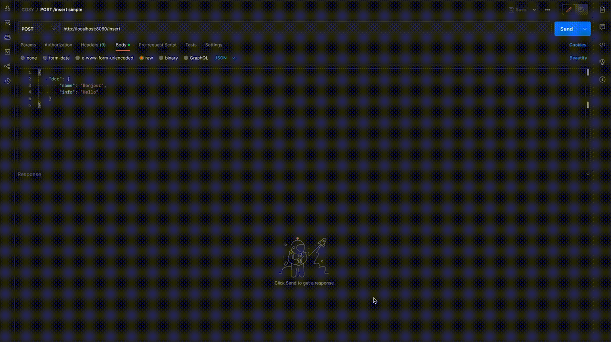
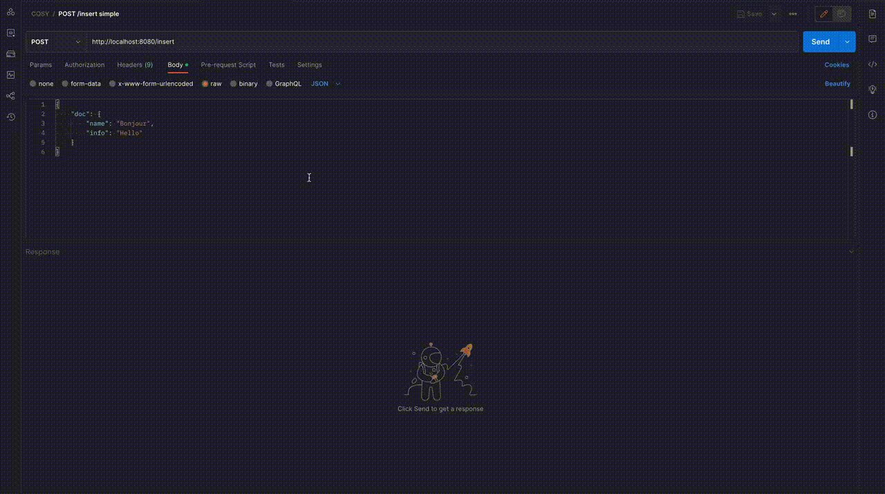
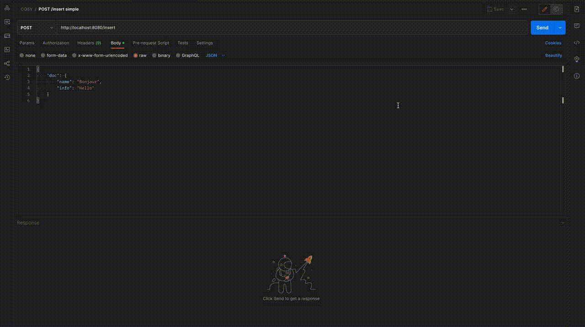

# CouchdbInserter

**Simple project to insert some docs in CouchDB.**

## Versions

erlang 23.1
elixir 1.11.1-otp-23
nodejs 15.1.0

## Installation

```zsh
foo@bar:~$ mix deps.get && mix deps.compile
foo@bar:~$ iex -S mix
```

## Screenshots

<kbd></kbd>

<kbd></kbd>

<kbd></kbd>

(Chunk are set to 2)
<kbd></kbd>

<kbd></kbd>

<kbd></kbd>

